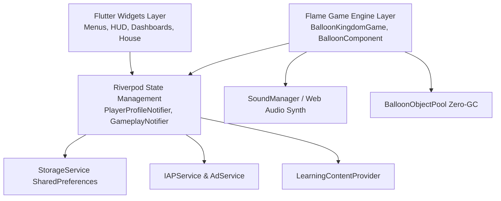
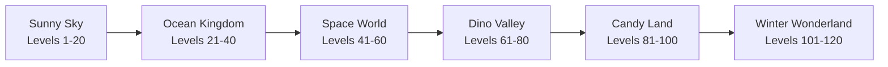

# Balloon Kingdom — Comprehensive Product & Architecture Documentation

> **Version:** 1.0.0 (Production Release)  
> **Target Audience:** Children aged 2–8, Parents, Educators  
> **Platforms:** Android, iOS, Web (Chromium / Safari)  
> **Engine & Framework:** Flutter 3.x + Flame Game Engine  
> **State Management:** Riverpod 2.x  
> **Compliance:** 100% Offline-First, COPPA & GDPR-K Compliant (Zero third-party tracking, zero mid-game ads)

---

## 1. Executive Summary & Vision

**Balloon Kingdom** is a premium offline educational game designed specifically for early childhood development (ages 2–8). The core premise transforms a child's natural love for popping balloons into an engaging, multi-sensory learning journey.

### Design Pillars
1. **Joyful Multi-Sensory Feedback**: Every tap triggers instant, satisfying visual, auditory, and haptic rewards (custom pop frequencies, wobble physics, colorful confetti bursts, particle explosions).
2. **Incidental & Phonics-Based Learning**: Rather than feeling like flashcards or tests, educational concepts (alphabet, phonics, numbers, shapes, colors, and animal vocabulary) are woven directly into balloons and celebratory reward screens.
3. **Gentle, Non-Violent Metaphors**: Hazard balloons (such as "Bomb" balloons) do not explode violently; instead, they pop with a soft cloud puff and a harmless squeak, preventing any distress or overstimulation.
4. **Ethical, Child-Safe Monetization**: No banner ads, no video interstitials during gameplay, no deceptive dark patterns, and no loot boxes. A single arithmetic-gated one-time Deluxe Pass unlocks all content.
5. **Universal Accessibility**: Built-in support for high-contrast contours, colorblind-safe palettes (Okabe-Ito / Wong), voice narration, and parent-monitored screen-time rest reminders.

---

## 2. Technical Stack & System Architecture



### Core Technologies
- **Flutter Framework (`3.41.6` / Dart `3.11.4`)**: Provides the cross-platform rendering tree for all menus, collectible interfaces, dialogues, and parental settings.
- **Flame Game Engine (`1.35.0`)**: Powers the 60 FPS physics loop, balloon floating trajectories, wobble matrix transformations, collision detection, and particle bursts.
- **Flutter Riverpod (`2.6.1`)**: Predictable unidirectional state management separating gameplay transient state from persistent player progression.
- **Flutter Animate (`4.5.2`)**: Micro-animations for bouncy buttons, shimmering star badges, level celebrations, and pet reactions.
- **Web Audio API Synthesizer Fallback**: Programmatic sine, square, and frequency-sweep audio generation ensuring zero audio lag or missing-asset crashes in any offline or web environment.
- **Custom Object Pooling (`BalloonObjectPool`)**: Reuses balloon entity instances to prevent memory fragmentation and Garbage Collection (GC) frame-drops during intense popping sessions.

---

## 3. Curriculum & Educational Systems

The learning system is powered by `LearningContentProvider` and covers 5 core modules:

```
Alphabet (A–Z)   ──> 26 Phonics Letters with uppercase/lowercase & keywords
Numbers (1–20)   ──> Counting dots, numeric symbols, and quantity recognition
Shapes (8)       ──> Circle, Square, Triangle, Star, Heart, Diamond, Hexagon, Oval
Colors (8)       ──> Red, Blue, Green, Yellow, Orange, Purple, Pink, Cyan
Animals (10)     ──> Dog, Cat, Lion, Elephant, Monkey, Panda, Cow, Duck, Frog, Bear
```

### Interactive Pop Overlay (`LearningPopOverlay`)
When an educational balloon is popped:
1. Gameplay pauses gently for 1.8 seconds.
2. A vibrant 3D pop card emerges with the character/symbol, associated keyword (e.g., *"A is for Apple"*), and phonics sound description.
3. Audio synthesis plays the spoken phoneme and celebratory chord.
4. Coins and stars are added directly to the child's collection.

---

## 4. Balloon Types & Gameplay Mechanics

The game features 10 distinct balloon varieties with specialized behaviors:

| Balloon Type | Appearance & Indicator | Behavior & Effect on Pop |
| :--- | :--- | :--- |
| **Standard** | Vibrant solid colors | Base score (+1 point), 1 coin chance, pop sound. |
| **Golden** | Shimmering metallic gold | High-value (+5 points), +3 coins, sparkle particle burst. |
| **Rainbow** | Dynamic color cycle | Bonus points (+3 points), +2 coins, rainbow confetti stream. |
| **Bomb (Soft Puff)** | Charcoal with gentle fuse | -1 life in Challenge Mode; soft cartoon puff sound (no screen shake). |
| **Freeze / Ice** | Translucent cyan snowflake | Triggers Slow-Motion for 4 seconds, reducing all balloon speeds by 50%. |
| **Rocket** | Aerodynamic crimson missile | Launches upward, automatically popping all balloons in its trajectory. |
| **Heart / Life** | Glowing pink heart | Grants +1 extra life (up to a maximum of 5 lives). |
| **Timer Bonus** | Golden hourglass | Extends challenge mission countdown timer by +5 seconds. |
| **Learning** | Inscribed letter/number/shape | Triggers interactive educational overlay card and phonics audio. |
| **Mystery** | Violet balloon with `?` | Random surprise: bursts into coins, slow-mo, or multi-balloon chain pops. |

---

## 5. The 6 Thematic Worlds (120 Levels)

Balloon Kingdom spans 6 uniquely themed worlds, each featuring custom background gradients, environmental decor, specialized spawn intervals, and 20 handcrafted levels (120 levels total):



1. **Sunny Sky**: Bright morning ambiance, floating puffy clouds, rolling green hills, gentle wind physics.
2. **Ocean Kingdom**: Deep turquoise water, floating air bubbles, sea anemones, coral reefs, and swimming schools of fish.
3. **Space World**: Midnight cosmic void, orbiting planets, twinkling constellations, nebulas, and floating satellites.
4. **Dinosaur Valley**: Prehistoric amber skies, volcanic silhouettes, ferns, palm leaves, and flying pterodactyls.
5. **Candy Land**: Pastel pink marshmallow clouds, chocolate rivers, candy cane pillars, and lollipop trees.
6. **Winter Wonderland**: Glacial blue skies, falling snowflakes, snow-capped pines, and glowing aurora borealis.

---

## 6. Collectibles, Pets, House & Mini-Games

### Pet Sanctuary (`Pet`)
- **8 Collectible Species**: Puppy, Kitten, Bunny, Dragon, Fox, Owl, Penguin, Unicorn.
- **Feeding & Leveling**: Children feed pets collected treats (`petFood`). Each meal increases XP, leading to pet level-ups and happy bounce animations.
- **Egg Hatching**: Children spend earned coins to hatch new surprise pet companions.

### Sticker Album (`StickerCatalog`)
- **32 Collectible Stickers**: Organized across 8 categories (Animals, Sweets, Vehicles, Space, Nature, Ocean, Kingdom, Holidays).
- Unlocked stickers can be viewed, tapped for sound effects, and admired in the album.

### Customizable Balloon House (`HouseCatalog`)
- **5 Distinct Rooms**: Living Room, Bedroom, Kitchen, Playroom, and Garden Patio.
- **Customization Slots**: Wallpaper, Flooring, Furniture, Accessories, and Lighting fixtures customizable with coins.

### Mini-Game Arcade (`MiniGameConfig`)
- **Balloon Rush**: Fast-paced 30-second popping frenzy.
- **Color Match**: Pop only the requested target color.
- **Pop 'Em All**: Clear 50 balloons before any escape off the top of the screen.

---

## 7. Parental Controls & Universal Accessibility

### Arithmetic Child-Lock Gate (`ParentGateDialog`)
- Access to the Parent Dashboard requires solving a multi-choice addition equation ($A + B = ?$).
- Automatically generates distractor numbers and regenerates upon incorrect attempts.

### Screen Time Limit Manager (`ScreenTimeLimitDialog`)
- Configurable session limits: **15 min**, **30 min**, **45 min**, **60 min**, or **Unlimited**.
- When the timer expires, a friendly resting balloon graphic gently asks the child to take a screen break.

### Accessibility Enhancements
- **High-Contrast Contour Rendering**:
  - Outlines balloons with a bold 3.5px dark stroke on the canvas, ensuring clear boundary visibility for children with low visual acuity.
- **Colorblind-Safe Palettes**:
  - Implements the barrier-free Wong / Okabe-Ito chromatic scale:
    - Standard Red $\rightarrow$ Vermilion (`#D55E00`)
    - Standard Green $\rightarrow$ Bluish Green (`#009E73`)
    - Standard Blue $\rightarrow$ Cobalt Blue (`#0072B2`)
    - Standard Yellow $\rightarrow$ Amber (`#E69F00`)
    - Standard Purple $\rightarrow$ Reddish Purple (`#CC79A7`)
- **Voice Narration**:
  - Spoken audio feedback for letters, numbers, and congratulations.

---

## 8. Directory & File Structure

```
lib/
├── core/
│   ├── audio/
│   │   └── sound_manager.dart          # Sound effects synthesizer & SFX manager
│   ├── constants/
│   │   ├── app_colors.dart            # Harmonious color tokens & gradients
│   │   ├── app_text_styles.dart       # Typography standards (Nunito / Fredoka)
│   │   └── game_constants.dart        # Gameplay physics, intervals & limits
│   ├── di/
│   │   └── providers.dart             # Riverpod global dependency providers
│   ├── monetization/
│   │   ├── ad_service.dart            # Rewarded video simulation (Child-friendly)
│   │   └── iap_service.dart           # Offline Deluxe Pass purchase & restore
│   └── storage/
│       └── storage_service.dart       # SharedPreferences persistence
├── features/
│   ├── gameplay/
│   │   ├── domain/
│   │   │   ├── models/                # BalloonType, LevelConfig, ChallengeMission
│   │   │   └── services/              # BalloonObjectPool (Zero GC)
│   │   └── presentation/
│   │       ├── components/            # BalloonComponent (Flame Entity), Particle
│   │       ├── game/                  # BalloonKingdomGame (FlameGame loop)
│   │       ├── providers/             # GameplayNotifier & session state
│   │       └── views/                 # GameplayScreen, GameHudOverlay, Dialogs
│   ├── home/
│   │   └── presentation/              # HomeScreen with dynamic navigation
│   ├── house/
│   │   ├── domain/                    # HouseCatalog, RoomDecor, HouseSlot
│   │   └── presentation/              # HouseScreen with room tab switcher
│   ├── learning/
│   │   ├── domain/                    # LearningItem, LearningCategory, Provider
│   │   └── presentation/              # LearningSelectionScreen, PopOverlay
│   ├── minigames/
│   │   ├── domain/                    # MiniGameConfig catalog
│   │   └── presentation/              # MiniGameHubScreen & MiniGameModal
│   ├── parental/
│   │   └── presentation/views/        # ParentGateDialog, ParentDashboardScreen
│   ├── pets/
│   │   ├── domain/                    # Pet model, species presets, hatching
│   │   └── presentation/              # PetSanctuaryScreen with feeding interaction
│   ├── rewards/
│   │   ├── domain/                    # PlayerProfile, RewardService, Stickers
│   │   └── presentation/              # StickerAlbumScreen
│   ├── shop/
│   │   ├── domain/                    # ThemeModel catalog (11 theme packs)
│   │   └── presentation/              # ShopScreen with preview & equip
│   ├── story/
│   │   ├── domain/                    # KingdomStoryModel, KingdomBeat
│   │   └── presentation/              # StoryWorldScreen with landmark restoration
│   └── worlds/
│       ├── domain/                    # WorldConfig (6 worlds, 120 levels)
│       └── presentation/              # WorldMapScreen, LevelSelectScreen
└── main.dart                          # App bootstrap & initialization
```

---

## 9. Developer & Deployment Guide

### Running Locally
To launch the game on the local Chrome browser:
```powershell
flutter run -d chrome
```

To run on an attached Android device or emulator:
```powershell
flutter run -d android
```

### Running Test Suite
Execute the comprehensive automated test suite (31 tests):
```powershell
flutter test
```

### Static Analysis
Ensure zero warnings and clean code metrics:
```powershell
flutter analyze
```

### Building Release Bundles
To generate a release Android App Bundle (AAB):
```powershell
flutter build appbundle --release
```

To generate a production Web release:
```powershell
flutter build web --release
```
